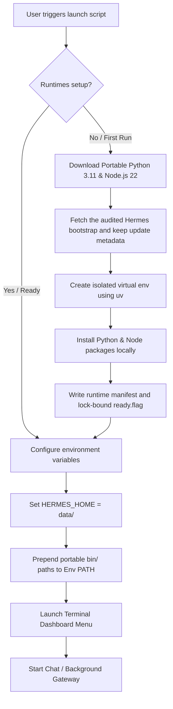

# <p align="center">🛸 Hermes Portable AI Workbench</p>

<p align="center">
  
  
  
</p>

---

<p align="center">
  <strong>A portable AI operations workbench powered by Hermes Agent and remote model APIs.</strong><br>
  No local GGUF model runtime. Private data and generated state are kept outside Git in the selected portable workspace.
</p>

<p align="center">
  <a href="https://youtu.be/gL220WHXWeo" target="_blank">
    
  </a>
  <br>
  <em>📺 <strong>Watch the Setup & Demo Video:</strong> Click the image above to watch the step-by-step walkthrough.</em>
</p>

---

## ✨ Key Features

*    **Zero Host Dependencies**: No pre-installed Python, Node.js, or package managers required on the computer. All runtimes are downloaded locally.
*    **100% Portable**: Copy the entire directory to a USB flash drive or external SSD. Run it on any Windows, macOS, or Linux computer instantly.
*    **True Privacy & Isolation**: Your API keys (`data/.env`), conversations (`data/sessions/`), persistent memory, and custom skills are kept strictly within the portable folder.
*    **Interactive Console Launcher**: Includes a beautiful terminal UI dashboard with state-tracking for setup status, LLM providers, and background gateways.
*    **Full Hermes Capabilities**: Retains all features of [Nous Research's Hermes Agent](https://github.com/NousResearch/hermes-agent), including memory storage and reusable skill generation.

## 🚧 Current Development Status

Development is on `feat/portable-initializer`. The verified P0 baseline currently includes:

- A repeatable ordinary-directory initializer that preserves existing user data and never formats storage.
- A tracked Windows x64 component lock with exact versions, archive sizes and SHA-256 values, plus an auditable Hermes bootstrap commit that does not block later updates.
- Dependency-free initializer and lock tests on Windows PowerShell 5.1 and PowerShell 7.

The custom Stitch workbench UI, full CLI/TUI/Desktop/WebUI entry set, model/proxy manager, private Obsidian integration, driver repository workflow, and real printer installation are planned work and are not implemented yet. The inherited launchers remain available, but cross-platform portability and host-write behavior have not yet completed the new project audit.

See the Chinese [project plan and live phase checklist](docs/PROJECT-PLAN.md) for the current P-stage, task IDs, acceptance gates, and implementation order.

---

## ⚡ Quick Start

Get Hermes running in seconds depending on your operating system:

### Windows (10 / 11)
Simply double-click the **`launch.bat`** file in this folder.
> *Note: On first run, it will launch a PowerShell window to download dependencies and configure your runtime environment.*

###  macOS & Linux
Open your terminal in this directory and execute:
```bash
chmod +x launch.sh
./launch.sh
```

> 💡 **macOS Double-Click Shortcut:** If you want to double-click in Finder to launch, rename `launch.sh` to `launch.command`. macOS recognizes `.command` files and opens them in Terminal automatically.

---

## ⚙️ How It Works (Under the Hood)

Hermes Portable solves the host-dependency issue by establishing a sandboxed runtime context pointing inwards.



### The Isolation Design
1. **Custom Data Directory**: The launcher overrides `HERMES_HOME` to the local `data/` folder, forcing Hermes to write configuration and data locally rather than in `~/.hermes/`.
2. **Local Path Sandboxing**: The scripts download self-contained Python and Node.js binaries into `.cache/runtimes/` and prepend them directly to the active process `PATH`.
3. **No Registry/Host Pollution**: System configurations, environment variables, or packages on the host machine are left untouched.

---

## 📁 Workspace Directory Structure

A clean, modular layout where runtime caches are separated from your personal configurations.

```yaml
hermes-portable/
├── launch.bat                 # Windows interactive launcher script
├── launch.sh                  # macOS & Linux interactive launcher script
├── scripts/
│   ├── setup-windows.ps1      # Windows first-run configuration script
│   └── setup-unix.sh          # Unix (macOS/Linux) first-run configuration script
├── data/                      # ⚠️ [BACKUP THIS] All your private files
│   ├── config.yaml            # Hermes LLM provider configurations
│   ├── .env                   # API Keys and active credentials
│   ├── sessions/              # Chronological chat histories
│   ├── memories/              # Persistent memory databases
│   └── skills/                # Learned custom skills
├── src/                       # Downloaded Hermes Agent source code
│   └── hermes-agent/
└── .cache/                    # Sandbox cache & binaries
    └── runtimes/              # Platform-specific portable interpreters
        ├── windows-x64/
        ├── macos-arm64/
        ├── macos-x64/
        ├── linux-x64/
        └── linux-arm64/
```

---

## 🗝️ Setup API Keys

To configure your language models, open and edit the environment variables in `data/.env`:

```env
# Add the keys for the providers you wish to use:
OPENROUTER_API_KEY=sk-or-v1-xxxxxxxxxxxxxxxx
OPENAI_API_KEY=sk-proj-xxxxxxxxxxxxxxxx
ANTHROPIC_API_KEY=sk-ant-xxxxxxxxxxxxxxxx
```

Alternatively, you can select option **`[2]` (Setup / Reconfigure)** in the Launcher Terminal Menu to configure model providers interactively.

---

## 🧠 Model Runtime Policy

This project targets remote model APIs. Local GGUF models, llama.cpp, and a bundled Ollama runtime are intentionally outside the main product scope. Provider credentials and model routing will be managed through Hermes-compatible configuration and the planned workbench UI.

---

## 🖥️ Supported Platforms

| Operating System | CPU Architecture | Setup Status | Notes |
| :--- | :--- | :--- | :--- |
| **Windows 10 / 11** | x86_64 | 🚧 P0 in progress | Initializer and component-lock tests are verified; complete setup still needs a Windows installation test |
| **macOS 13+** | Apple Silicon (ARM64) | ⚠️ Inherited / unverified | Upstream launcher exists; new portability audit not complete |
| **macOS 13+** | Intel (x86_64) | ⚠️ Inherited / unverified | Upstream launcher exists; new portability audit not complete |
| **Linux** | x86_64 / ARM64 | ⚠️ Inherited / unverified | Upstream launcher exists; new portability audit not complete |

---

## 📦 Cache & Runtime Footprint

The current Windows x64 full first-run setup was measured at about **1.5 GB total** after setup completed.

| Component | Measured / Expected Size | Notes |
| :--- | :--- | :--- |
| **Launchers & Scripts** | <1 MB | Metadata and setup automation scripts |
| **Windows x64 Runtime** | ~800 MB | Python, Node.js, uv, Git, ripgrep, venv, and downloaded archives |
| **Playwright / Local App Cache** | ~400 – 500 MB | Chromium browser cache used by Hermes web tools |
| **Hermes Source Code** | ~100 MB | Downloaded Hermes Agent source tree |
| **User Data** | ~10 MB → 2 GB+ | Grows as memory, logs, sessions, skills, and backups accumulate |

Recommended USB / external drive free space:

| Use Case | Free Space to Reserve |
| :--- | :--- |
| **One platform only** | **2 GB minimum**, **4 GB recommended** |
| **Windows + one Unix platform** | **4 – 6 GB recommended** |
| **Windows + macOS + Linux runtimes** | **8 GB+ recommended** |
| **Heavy long-term use with many sessions/backups** | **16 – 32 GB recommended** |

> ℹ️ *Each operating system and CPU architecture gets its own `.cache/runtimes/<platform>-<arch>/` folder, so using the same USB drive across Windows, macOS, and Linux will increase storage usage.*

---

## 🔄 Updating Hermes Agent

Hermes is updateable and is not permanently locked to the bootstrap version recorded in `manifests/runtime-components.windows-x64.json`. The bootstrap entry provides a known first-install state; the installed version may advance through the inherited launcher **Update Hermes** option or the official `hermes update` command.

The P0 update work adds pre-update checks, installed-version/commit recording, user-data preservation checks, post-update health checks, and rollback around that upstream capability. Stable releases are the intended default channel; tracking upstream `main` remains an explicit higher-risk option. Python, Node.js, uv, Git, and other Runtime archives remain separately integrity-checked.

---

## 🔒 Security Advisory

> [!WARNING]
> **Your portable directory contains your identity.**
> Because `data/.env` stores raw API keys and `data/sessions/` contains logs of your conversations, anyone with access to your portable drive can access your accounts.
> 
> *   **Recommended Action**: Encrypt your USB flash drive or SSD using **BitLocker** (Windows), **FileVault** (macOS), or a cross-platform utility like **VeraCrypt**.
> *   Avoid storing large API balances or production keys on drives you carry daily.

---

## 🔍 Troubleshooting & FAQ

<details>
<summary><strong> First-run setup fails or times out</strong></summary>

*   Verify your internet connection (the setup downloads ~600 MB of data).
*   Some corporate/school firewall settings block Node.js CDNs or GitHub releases. Try configuring a VPN.
*   Delete the `.cache/` folder and launch again to clean-install the runtimes.
</details>

<details>
<summary><strong> macOS: "cannot be opened because the developer cannot be verified"</strong></summary>

*   Right-click `launch.sh` (or `launch.command`), choose **Open With** and select **Terminal**.
*   Alternatively, open terminal and strip macOS quarantine flags using:
    ```bash
    xattr -dr com.apple.quarantine /path/to/hermes-portable
    ```
</details>

<details>
<summary><strong> Windows Defender flags the launcher scripts</strong></summary>

*   This is a false positive caused by PowerShell scripts downloading files from remote sources (GitHub & Node.js servers).
*   Click **"More info"** on the Windows SmartScreen dialog, then click **"Run anyway"**.
*   The setup scripts are fully open-source and human-readable under the `scripts/` directory for your inspection.
</details>

<details>
<summary><strong> Hermes is running slowly from my flash drive</strong></summary>

*   Older USB 2.0 drives have slow read/write speeds, which bottleneck Python's modules import.
*   **Solution**: Upgrade to a **USB 3.0 / 3.1** drive, or an **external SSD** for optimal performance.
</details>

<details>
<summary><strong> Playwright / Web Browser tools are failing</strong></summary>

*   Some OS sandboxing policies restrict web browsers (Chromium/Firefox) from starting directly inside external/removable directories.
*   **Solution**: Copy the `hermes-portable` directory onto the local SSD and run from there.
</details>

---

## 📝 Credits & Attribution

*   **[Hermes Agent](https://github.com/NousResearch/hermes-agent)** — Powerful Agentic core created by [Nous Research](https://github.com/NousResearch).
*   **[python-build-standalone](https://github.com/indygreg/python-build-standalone)** — Portable Python interpreter compilation.
*   **[uv](https://github.com/astral-sh/uv)** — Blazing fast package installer and resolver.
